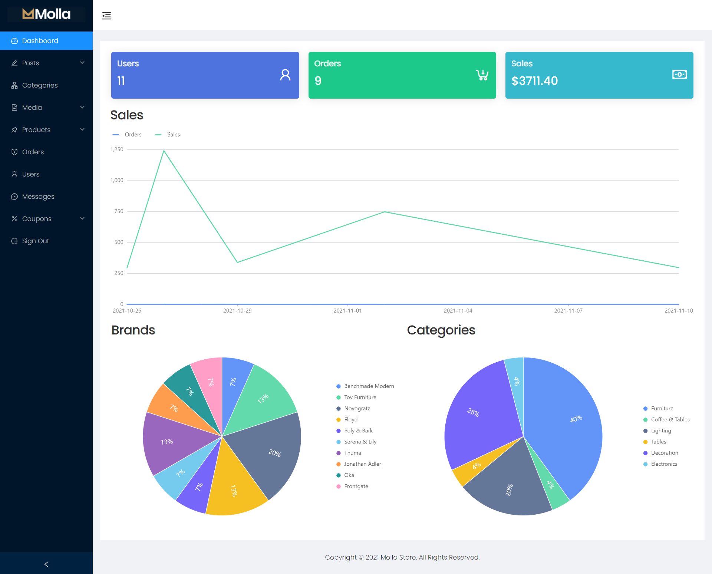

# Interior Ecommerce

> Ecommerce platform built with the MERN stack & Redux.

> Demo: https://interior-ecommerce.herokuapp.com

Here is a screenshot of the homepage


Here is a screenshot of the admin page



## Features

### Normal User

- Sign up/Sign in/Sign out
- Forgot and reset password
- Can see hot trend products
- Can see recently viewed products
- Can filter Products via alphabet, classify (product), price, category, rating …
- Can see his summary (history order, his cart)
- Can see profile
- Update profile
- Can order product
- Can checkout
- Can see information/image/price/number of products
- Can comment in each product
- Can share on social in each product
- Can see products in the cart when he choice
- Can rating below each products
- Can add more product to cart
- Can remove product from cart

### Admin

- Can view statistic (chart)
- Can manage all users
- Can manage all categories (Multi-level Menu)
- Can manage all product (with images)
- Can manage all list order

## Usage

### ES Modules in Node

I use ECMAScript Modules in the backend in this project. Be sure to have at least Node v14.6+ or you will need to add the "--experimental-modules" flag.

Also, when importing a file (not a package), be sure to add .js at the end or you will get a "module not found" error

You can also install and setup Babel if you would like

### Env Variables

Create a .env file in then root and add the following

```
NODE_ENV = development
PORT = 8000
MONGO_URI = your mongodb uri
JWT_SECRET = 'something'
PAYPAL_CLIENT_ID = your paypal client id
ACCESSS_KEY_ID = your aws accesss key
SECRET_ACCESSS_KEY = your aws secret key
SENDGRID_API = your sendgrid key
```

### Install Dependencies (frontend & backend)

```
npm install
cd frontend
npm install
```

### Run

```
# Run frontend
npm start

# Run backend
npm start
```

## Build & Deploy

```
# Create frontend prod build
cd frontend
npm run build
```

There is a Heroku postbuild script, so if you push to Heroku, no need to build manually for deployment to Heroku
